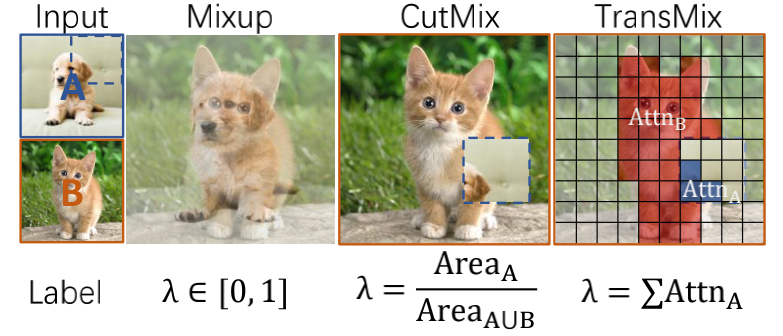
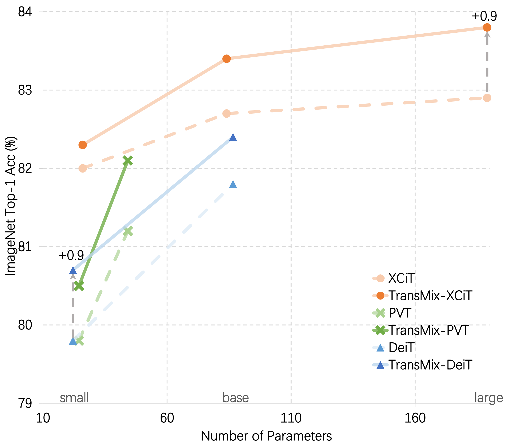

# TransMix: Attend to Mix for Vision Transformers

This repository includes the official project for the paper: [*TransMix: Attend to Mix for Vision Transformers*](https://arxiv.org/abs/2111.09833), CVPR 2022

<p align="center">
  
</p>

<p align="center">
  
</p>

# Key Feature

Improve your Vision Transformer (ViT) by ~1% on ImageNet with minimal computational cost and a simple ```--transmix```.

# Getting Started

First, clone the repo:
```shell
git clone https://github.com/Beckschen/TransMix.git
```

Then, you need to install the required packages including: [Pytorch](https://pytorch.org/) version 1.7.1,
[torchvision](https://pytorch.org/vision/stable/index.html) version 0.8.2,
[Timm](https://github.com/rwightman/pytorch-image-models) version 0.5.4
and ```pyyaml```. To install all these packages, simply run
```
pip3 install -r requirements.txt
```

Download and extract the [ImageNet](https://imagenet.stanford.edu/) dataset to ```data``` folder. Suppose you're using
8 GPUs for training, then simply run 
```shell
bash ./distributed_train.sh 8 data/ --config $YOUR_CONFIG_PATH_HERE
```

By default, all our config files have enabled the training with TransMix.
If you want to enable TransMix during the training of your own model,
you can add a ```--transmix``` in your training script. For example:
```shell
python3 -m torch.distributed.launch --nproc_per_node=8 train.py data/ --config $YOUR_CONFIG_PATH_HERE --transmix
```

Or you can simply specify ```transmix: True``` in your ```yaml``` config file like what we did in [deit_s_transmix](configs/deit_s_transmix.yaml).

To evaluate your model trained with TransMix, please refer to [timm](https://github.com/rwightman/pytorch-image-models#train-validation-inference-scripts).
You can also find your validation accuracy during training.

# Model Zoo

Coming soon!

## Acknowledgement 
This repository is built using the [Timm](https://github.com/rwightman/pytorch-image-models) library and 
the [DeiT](https://github.com/facebookresearch/deit) repository.

## License
This repository is released under the Apache 2.0 license as found in the [LICENSE](LICENSE) file.

## Cite This Paper
If you find our code helpful for your research, please using the following bibtex to cite our paper:

```
@InProceedings{transmix,
title = {TransMix: Attend to Mix for Vision Transformers},
author = {Chen, Jie-Neng and Sun, Shuyang and He, Ju and Torr, Philip and Yuille, Alan and Bai, Song},
booktitle = {The IEEE Conference on Computer Vision and Pattern Recognition (CVPR)},
month = {June},
year = {2022}
}
```
